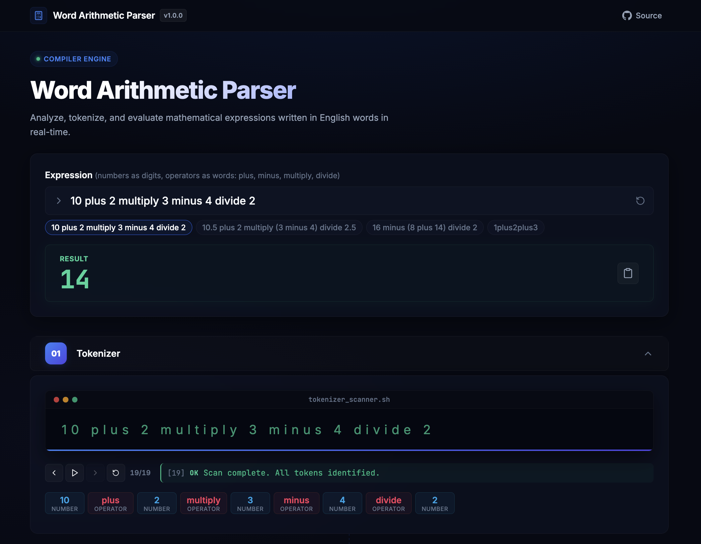
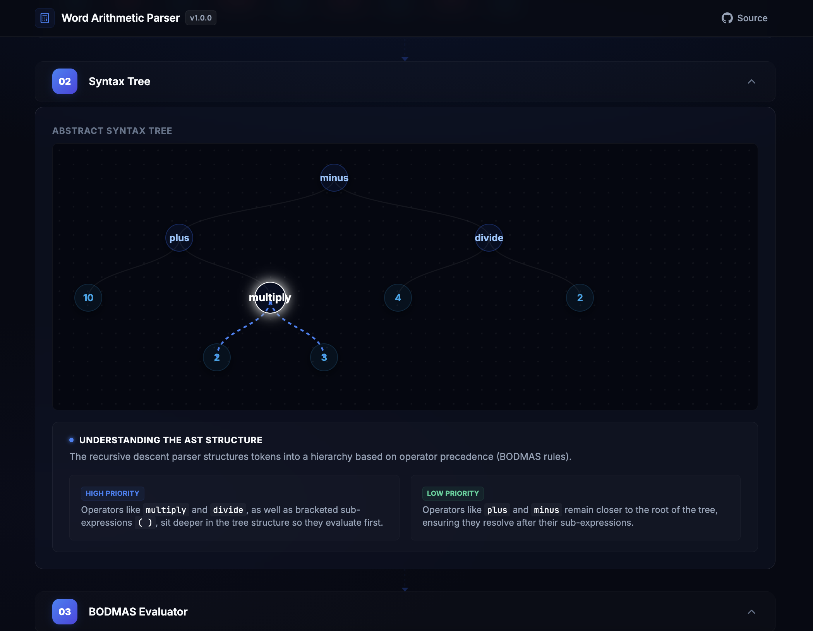
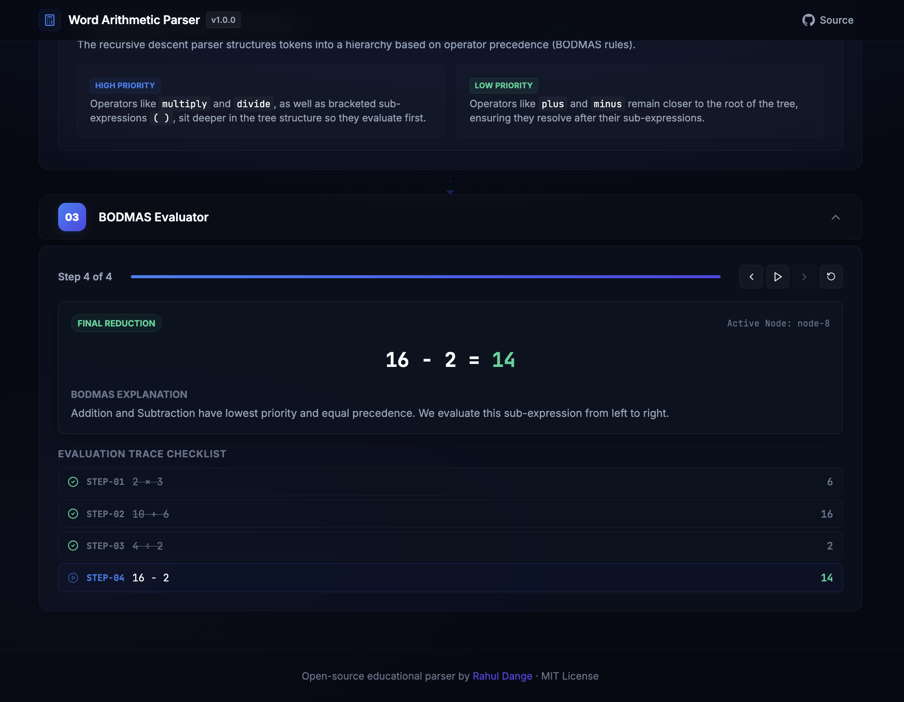

<div align="center">

# Word Arithmetic Parser

### Case-Insensitive English Word Arithmetic Parser & Compiler Visualizer

[](LICENSE)
[](src/parser/ArithmeticParser.js)

**A premium React Single-Page Application visualizing how arithmetic expressions written with English words are tokenized, parsed into AST trees, and evaluated under BODMAS precedence.**

[Live Demo](https://09-word-arithmetic-parser.vercel.app/) · [Grammar Spec](docs/GRAMMAR.md) · [Architecture](docs/ARCHITECTURE.md) · [Contributing](CONTRIBUTING.md)

</div>

---

## What Is This?

This is an educational compiler dashboard that parses and evaluates arithmetic expressions written with English operator words. Instead of using standard symbols, operators are written as case-insensitive English words:

```
10 plus 2 multiply 3 minus 4 divide 2   →   14
```

The parser constructs an **Abstract Syntax Tree (AST)** using a hand-written **recursive descent parser** to enforce **BODMAS** rules, and maps the entire sequence through interactive, visual tracers.

## Supported Operations

| Operator Word | Standard Symbol | Operation | Example Input | Result |
|---------------|-----------------|-----------|---------------|--------|
| plus          | `+`             | Addition | `5 plus 3` | `8` |
| minus         | `−`             | Subtraction | `10 minus 4` | `6` |
| multiply      | `×`             | Multiplication | `3 multiply 7` | `21` |
| divide        | `÷`             | Division | `20 divide 4` | `5` |
| `( )`         | `( )`           | Brackets | `(2 plus 3) multiply 4` | `20` |

**Also supports:** decimal numbers (`3.14`), case insensitivity (`10 PLUS 5`), and whitespace-agnostic inputs (`10plus5` = `10 plus 5`).

## Quick Start

### Browser / Node (ES Modules Core)

```javascript
import { ArithmeticParser } from './src/parser/ArithmeticParser.js';

const parser = new ArithmeticParser('10 plus 2 multiply 3');
const result = parser.parse();
console.log(result); // 16
```

### Try It Online

Visit the **[Live Demo](https://rahuldangeofficial.github.io/09-word-arithmetic-parser)**: type an expression and see the step-by-step visualizations instantly.

## Features & Visualizations

1. **Tokenizer Step**: Visual scan stream showing the raw characters matched and pushed to a typed token stream queue.
2. **Abstract Syntax Tree**: Displays a beautiful visual node graph of the parsed mathematical structure using HTML nodes and SVG connectors.
3. **BODMAS Stepper**: An evaluation playback player showing the tree collapsing step-by-step with grammatical explanation cards.

### Screenshot Gallery

| Dashboard & Tokenizer | AST Tree Visualization | BODMAS Evaluation Stepper |
| --- | --- | --- |
|  |  |  |

## Grammar

The parser implements a context-free grammar that enforces BODMAS through its hierarchical structure:

```ebnf
Expression  ::=  Term ( ( 'plus' | 'minus' ) Term )*
Term        ::=  Factor ( ( 'multiply' | 'divide' ) Factor )*
Factor      ::=  Number | '(' Expression ')'
Number      ::=  [0-9]+ ( '.' [0-9]+ )?
```

> Full grammar specification: [docs/GRAMMAR.md](docs/GRAMMAR.md)

## Project Structure

```
09-word-arithmetic-parser/
├── package.json                   # React, Vite & scripts configuration
├── yarn.lock                      # Lockfile
├── vite.config.js                 # Vite config
├── index.html                     # Vite Entry HTML
├── src/
│   ├── main.jsx                   # React Entry mounting
│   ├── App.jsx                    # Core App Dashboard component
│   ├── index.css                  # Global HSL dark theme CSS
│   ├── components/                # React visualizers and headers
│   │   ├── Header.jsx
│   │   ├── TokenizerStep.jsx
│   │   ├── AstTreeStep.jsx
│   │   └── EvaluationStep.jsx
│   └── parser/                    # Core parser compiler modules
│       ├── grammar.js
│       ├── tokenizer.js
│       └── ArithmeticParser.js
├── docs/
│   ├── GRAMMAR.md                 # Formal grammar specification
│   └── ARCHITECTURE.md            # Architecture & design decisions
├── examples/
│   ├── examples.html              # Standalone browser runner
│   └── examples.js                # Standalone Node examples / test runner
├── .gitignore
├── .editorconfig
├── LICENSE                        # MIT License
└── CONTRIBUTING.md                # Contribution guide
```

---

## How It Works

The parser processes input through a four-stage pipeline:

```
[Input String] ➔ [Tokenizer] ➔ [AST Builder] ➔ [Evaluator/Steps]
```

| Pipeline Stage | Input | Output | Component |
| :--- | :--- | :--- | :--- |
| **1. Tokenization** | Raw text string (e.g., `"10 plus 5"`) | Position-aware Tokens stream | `src/parser/tokenizer.js` |
| **2. Parsing (AST)** | Tokens stream | Hierarchical Abstract Syntax Tree | `src/parser/ArithmeticParser.js` |
| **3. Evaluation** | AST Tree | Final numeric result + evaluation steps | `src/parser/ArithmeticParser.js` |

1. **Tokenizer (`tokenizer.js`)**: Converts characters into structured, position-aware Tokens.
2. **Parser (`ArithmeticParser.js`)**: Combines tokens into recursive AST nodes based on precedence rules (`_expr()`, `_term()`, `_factor()`).
3. **AST Evaluator**: Traverses the syntax tree, evaluates operations under BODMAS precedence, and logs steps.

> Deep dive: [docs/ARCHITECTURE.md](docs/ARCHITECTURE.md)

---

## Running Locally

This project uses **Vite** and **Yarn** for package and dev server management.

1. Install dependencies:
   ```bash
   yarn install
   ```

2. Start the local server:
   ```bash
   yarn dev
   ```
   This starts the dev server at `http://localhost:8765` and launches the application in your browser.

## Running Tests

To run the console-based unit tests:
```bash
yarn test
```

## Contributing

Contributions are welcome! See [CONTRIBUTING.md](CONTRIBUTING.md) for details.

## License

[MIT](LICENSE) © 2026 [Rahul Dange](https://github.com/rahuldangeofficial)
