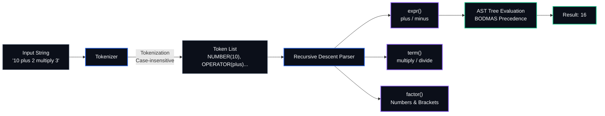

# Architecture & Design Decisions

> Technical architecture of the Word Arithmetic Parser: how it works, why it was built this way, and how it is structured.

## High-Level Architecture

The parser processes English word arithmetic expressions through a three-stage pipeline:

```
[Input String] ➔ [Tokenizer] ➔ [AST Builder] ➔ [Evaluator/Steps]
```

| Pipeline Stage | Input | Output | Component |
| :--- | :--- | :--- | :--- |
| **1. Tokenization** | Raw text string (e.g., `"10 plus 5"`) | Position-aware Tokens stream | `src/parser/tokenizer.js` |
| **2. Parsing (AST)** | Tokens stream | Hierarchical Abstract Syntax Tree | `src/parser/ArithmeticParser.js` |
| **3. Evaluation** | AST Tree | Final numeric result + evaluation steps | `src/parser/ArithmeticParser.js` |

### Pipeline Flow



---

## File-by-File Description

### Core Compiler Layer

| File | Purpose |
|------|---------|
| [grammar.js](../src/parser/grammar.js) | Single source of truth defining grammar constants, operator keywords, precedence levels (BODMAS), and semantic evaluation functions. |
| [tokenizer.js](../src/parser/tokenizer.js) | Scans the input string character-by-character, identifying number literals, parenthesis, and operator keywords case-insensitively, and producing a typed token stream. |
| [ArithmeticParser.js](../src/parser/ArithmeticParser.js) | Implements the LL(1) recursive descent parser. Constructs the AST hierarchy via `_expr()`, `_term()`, and `_factor()`, then evaluates it recursively while recording structural evaluation steps. |

### Web Interface & Components

| File | Purpose |
|------|---------|
| [index.html](../index.html) | Root HTML entry point specifying styling stylesheets and bootstrapping React components. |
| [App.jsx](../src/App.jsx) | Main dashboard component managing input state, real-time parser integration, and the overall responsive layout. |
| [Header.jsx](../src/components/Header.jsx) | Navigation bar displaying the clean brand title "Arithmetic Parser" exactly once. |
| [TokenizerStep.jsx](../src/components/TokenizerStep.jsx) | Interactive visual step-by-step scanner simulator that traces character matches. |
| [AstTreeStep.jsx](../src/components/AstTreeStep.jsx) | Canvas-based tree visualizer showing the generated Abstract Syntax Tree (AST). |
| [EvaluationStep.jsx](../src/components/EvaluationStep.jsx) | Interactive player showing step-by-step BODMAS reduction of the expression tree. |

---

## Design Decisions

### 1. Why Recursive Descent?

**Chosen:** Recursive descent parser  
**Alternatives considered:** Shunting-yard algorithm, parser generators (e.g. PEG.js, Nearley)

**Rationale:**
- **Simplicity & Readability**: Recursive descent parsers map grammar rules directly to programming functions (`_expr()`, `_term()`, `_factor()`).
- **Zero Dependencies**: Fits the education-oriented design by compiling expressions directly in vanilla Javascript without heavy parsing libraries.
- **Traceability**: Enables capturing the exact evaluation history at each tree node to power our interactive stepper interface.

### 2. Why No `eval()`?

The codebase explicitly avoids the use of Javascript's `eval()` or `new Function()` execution:
- **Security**: Evaluating arbitrary user inputs directly poses injection vulnerabilities.
- **Grammatical Integrity**: Implementing parsing from scratch shows how language compilation stages function rather than bypassing them.

### 3. How BODMAS Precedence is Enforced

Precedence is enforced structurally through the grammar hierarchy rather than checking precedence numbers dynamically at parse-time:

```
_expr()   -> handles addition / subtraction (plus, minus)
  ↓ calls
_term()   -> handles multiplication / division (multiply, divide)
  ↓ calls
_factor() -> handles number literals and bracket groupings ( )
```

Higher-precedence operations are resolved deeper in the recursion tree (in `_term()` and `_factor()`), ensuring they are grouped and evaluated first.

### 4. Case-Insensitive Tokenization

To make the parser robust, the tokenizer slices the input string and compares candidates against lowercase keywords (`plus`, `minus`, `multiply`, `divide`). The resulting token carries the normalized lowercase value, shielding the parser logic from case variations (e.g. `Plus`, `PLUS`).

---

## Extensibility

### Adding a New Operator

To add a new operator (e.g. `modulo`):

1. **Update `grammar.js`**: Define the operator metadata:
   ```javascript
   'modulo': {
     symbol: '%',
     type: 'MODULO',
     precedence: 2,
     evaluate: (a, b) => a % b,
   }
   ```
2. **Update the Parser**: Update the corresponding method in `ArithmeticParser.js` (e.g. `_term()` for priority 2 operators) to match and construct nodes for the new token.
3. **Verify**: Run the test scripts in `examples/examples.js` to ensure proper evaluation.
